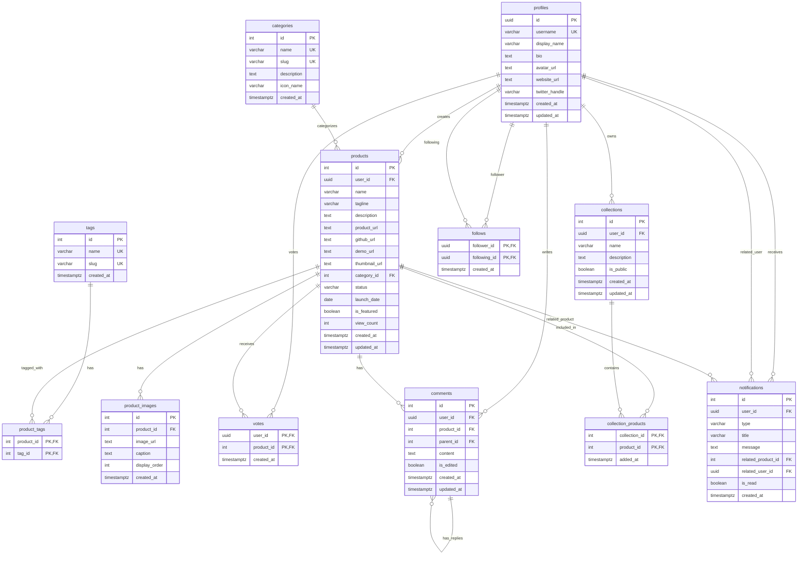

# NicheNext データベースER図

## ER図（Mermaid形式）

## テーブル詳細説明

### 1. ユーザー管理
- **profiles**: Supabase Authと連携したユーザープロファイル情報
- **follows**: ユーザー間のフォロー関係を管理

### 2. プロダクト関連
- **products**: メインのプロダクト情報（ニッチなビジネスアイデア）
- **product_images**: プロダクトの画像ギャラリー
- **product_tags**: プロダクトへのタグ付け（多対多）
- **categories**: プロダクトのカテゴリ分類

### 3. エンゲージメント機能
- **votes**: ユーザーのアップボート（投票）機能
- **comments**: ネスト可能なコメント機能（parent_idで返信を実現）
- **collections**: ユーザーが作成するプロダクトのキュレーション

### 4. システム機能
- **notifications**: リアルタイム通知機能
- **tags**: 検索・分類用のタグマスター

## 主要な特徴

1. **Row Level Security (RLS)**: profiles、products、votes、comments、collections、notificationsテーブルでRLSが有効
2. **複合主キー**: product_tags、votes、collection_products、followsテーブルで複合主キーを使用
3. **自己参照**: commentsテーブルのparent_idによるネスト構造
4. **多対多リレーション**: 
   - products ↔ tags（product_tags経由）
   - products ↔ collections（collection_products経由）
   - profiles ↔ profiles（follows経由）

## データベース統計情報
- **総テーブル数**: 12
- **推定レコード数**:
  - profiles: 6件
  - products: 21件
  - categories: 12件
  - tags: 27件
  - product_tags: 84件
  - votes: 26件
  - comments: 25件
  - その他: 各種エンゲージメントデータ

このER図は、NicheNextがニッチ市場向けのプロダクト共有プラットフォームとして、効率的なデータ管理と豊富なソーシャル機能を実現していることを示しています。
