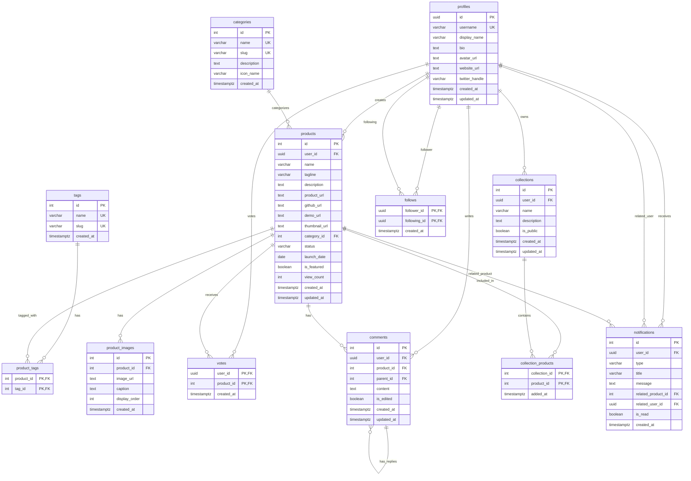

# CLAUDE.md

このファイルは、Claude Code (claude.ai/code) がこのリポジトリのコードを扱う際のガイドラインを提供します。

## コマンド

```bash
# 開発
npm run dev          # ポート4000で開発サーバーを起動

# ビルド & 本番環境
npm run build        # アプリケーションをビルド
npm run start        # 本番サーバーを起動

# コード品質
npm run lint         # ESLintを実行
```

## アーキテクチャ概要

NicheNextは、ニッチなビジネスアイデアを発見するためのProduct Huntスタイルのプラットフォームで、Next.js App RouterとSupabaseで構築されています。

### 主要なパターン

1. **サーバー/クライアントコンポーネントの分離**
   - サーバーコンポーネント (page.tsx) がデータフェッチを処理
   - クライアントコンポーネント (*Client.tsx) がインタラクティビティを処理
   - データはpropsとしてサーバーからクライアントに渡される

2. **効率的なデータフェッチング**
   ```typescript
   // 並列フェッチには常にPromise.allを使用
   const [products, categories, tags] = await Promise.all([
     getProducts(),
     getCategories(),
     getTags()
   ]);
   
   // データエンリッチメント時はO(1)ルックアップのためMapを使用
   const userMap = new Map(users.map(u => [u.id, u]));
   ```

3. **API構成**
   - `/lib/api/*-server.ts` - サーバーサイドのデータフェッチング
   - `/lib/api/*-client.ts` - クライアントサイドのミューテーション
   - 常に `createClient().auth.getUser()` で認証状態をチェック

### 認証フロー

メール/パスワードによるSupabase Auth:
- 認証状態はサーバーサイドで管理
- 保護されたルートはサーバーコンポーネントで認証をチェック
- クライアントサイドの認証更新はルーターのリフレッシュをトリガー

### UIコンポーネント

`/components/ui/` からshadcn/uiコンポーネントを使用:
- 常にローカルのuiディレクトリからインポート
- コンポーネントはRadix UIプリミティブ上に構築
- Tailwind CSSクラスでスタイリング

### 避けるべき一般的な落とし穴

1. クライアントコンポーネントでデータをフェッチしない - 常にサーバーから渡す
2. Edgeランタイムを使用しない - このアプリはNode.jsランタイムを使用
3. auth.getUser()がnullを返す場合を常に処理する
4. N+1クエリを避けるため、プロダクトリストには`products_with_stats`ビューを使用
5. 地域対応のため`locale`フィールドでプロダクトをフィルタリング
6. RLS（Row Level Security）によってデータアクセスをセキュア化

## 技術スタック

### フロントエンド
- **Next.js 15** - Reactベースのフルスタックフレームワーク
- **TypeScript** - 型安全性を確保
- **Tailwind CSS** - ユーティリティファーストのCSSフレームワーク
- **Radix UI** - アクセシブルなUIコンポーネントライブラリ
- **Framer Motion** - アニメーションライブラリ

### バックエンド/データベース
- **Supabase** - PostgreSQLベースのBaaS（Backend as a Service）
  - Supabase Auth（認証）
  - Supabase Database（PostgreSQL）
  - Row Level Security（RLS）によるセキュアなデータアクセス
  - **Supabase MCP** - データベース操作のためのModel Context Protocol

## データベース構造

13のテーブルとビューで構成される包括的なデータモデル：

### 1. ユーザー管理
- `profiles` - ユーザープロファイル（UUID、ユーザー名、表示名、バイオ、アバター等）
- `follows` - フォロー関係（フォロワー-フォロイング関係）

### 2. プロダクト機能
- `products` - ビジネスアイデア情報（国コード含む地域対応）
- `categories` - カテゴリ分類（アイコン付き）
- `tags` - タグ管理（名前とスラッグ）
- `product_tags` - プロダクトタグ関連付け
- `product_images` - 画像ギャラリー（表示順序対応）

### 3. エンゲージメント
- `votes` - アップボート機能（ユーザー-プロダクト）
- `comments` - ネスト可能なコメント（編集履歴付き）
- `collections` - キュレーション機能（公開・非公開設定）
- `collection_products` - コレクション内プロダクト管理

### 4. システム機能
- `notifications` - リアルタイム通知（関連プロダクト・ユーザー含む）

### 5. ビューとファンクション
- `products_with_stats` - プロダクト統計情報含むビュー（投票数、コメント数、保存済み状態等）
- `toggle_vote` - 投票切り替えファンクション

## 主要機能

### 1. プロダクト管理
- ビジネスアイデアの投稿・編集
- カテゴリ・タグによる分類
- 画像ギャラリー

### 2. ソーシャル機能
- ユーザープロファイル
- フォロー・フォロワー機能
- 投票（アップボート）
- コメント・返信
- コレクション作成

### 3. 探索・発見
- カテゴリ別閲覧
- トレンディング
- ランキング
- 詳細検索
- 地域別フィルタリング

### 4. 通知システム
- リアルタイム通知
- フォロー、コメント、投票の通知

## セキュリティ
- Supabase AuthによるJWT認証
- Row Level Security（RLS）によるデータアクセス制御
- セキュアなAPIエンドポイント

## プロジェクト構造
```
nichenext/
├── app/               # Next.js App Router
├── components/        # UIコンポーネント
├── lib/               # ユーティリティ・API
│   ├── api/          # APIクライアント
│   ├── supabase/     # Supabase設定
│   └── types/        # TypeScript型定義
├── contexts/          # React Context
├── hooks/            # カスタムフック
└── supabase/         # マイグレーション
```

## データベースER図



## 重要な技術的詳細
- 実行ログをJSONとして`.claude-execution-output.json`に出力
- データベース更新・新規・削除作成は必ず以下の箇条書きを作成・更新する
  - `CLAUDE.md`の`データベースER図`を更新する
  - `./supabase/complete_schema_backup_yyyymmdd.md`の作成・更新する
- データベースの参照する指示は必ずSupabase MCPを利用する