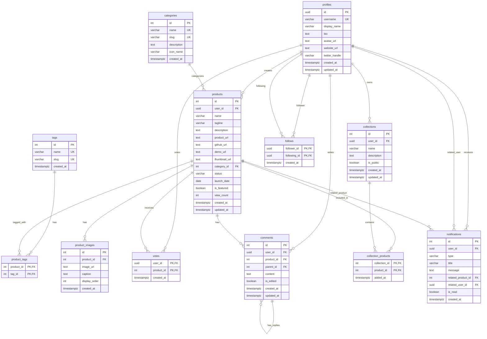

# NicheNext データベース包括バックアップ

## バックアップ情報
- **生成日時**: 2025-06-07 00:58:00 JST
- **プロジェクトID**: nyniibuebpmsbmzhccjr
- **データベースバージョン**: PostgreSQL 15.8.1.093
- **リージョン**: ap-northeast-1 (Asia Pacific - Tokyo)

## 目次
1. [マイグレーション履歴](#マイグレーション履歴)
2. [ER図](#er図)
3. [テーブル統計](#テーブル統計)
4. [スキーマ詳細](#スキーマ詳細)

## マイグレーション履歴

| バージョン | マイグレーション名 | 説明 |
|-----------|------------------|------|
| 20250524044504 | add_profiles_insert_policy | プロファイル挿入ポリシー追加 |
| 20250524113711 | create_base_tables | 基本テーブル作成 |
| 20250524113726 | create_products_tables | プロダクトテーブル作成 |
| 20250524113744 | create_interaction_tables | インタラクションテーブル作成 |
| 20250524113758 | create_social_tables | ソーシャル機能テーブル作成 |
| 20250524113815 | create_indexes | インデックス作成 |
| 20250524113826 | create_views | ビュー作成 |
| 20250524113836 | enable_rls | Row Level Security有効化 |
| 20250524113847 | create_profile_policies | プロファイルポリシー作成 |
| 20250524113900 | create_product_policies | プロダクトポリシー作成 |
| 20250524113915 | create_vote_comment_policies | 投票・コメントポリシー作成 |
| 20250524113935 | create_toggle_vote_function | 投票切り替え関数作成 |
| 20250524113950 | create_update_timestamp_triggers | タイムスタンプ更新トリガー作成 |
| 20250524114333 | create_dummy_auth_users | ダミー認証ユーザー作成 |
| 20250524114907 | recreate_products_with_stats_view | 統計付きプロダクトビュー再作成 |
| 20250525073845 | add_test_notifications_for_current_user | 現在ユーザー向けテスト通知追加 |
| 20250525081704 | add_notifications_for_any_user | 任意ユーザー向け通知追加 |
| 20250525085847 | add_notifications_rls_policies | 通知RLSポリシー追加 |
| 20250525123623 | add_collections_rls_policies | コレクションRLSポリシー追加 |
| 20250526033048 | add_is_saved_to_products_view | プロダクトビューに保存状態追加 |
| 20250528120456 | create_storage_buckets | ストレージバケット作成 |
| 20250531041357 | add_icon_url_to_products | プロダクトにアイコンURL追加 |
| 20250531063552 | add_product_update_rls_policy | プロダクト更新RLSポリシー追加 |
| 20250531064832 | add_product_update_rls_policy | プロダクト更新RLSポリシー追加（重複） |
| 20250531103029 | enable_update_own_products_policy | 自分のプロダクト更新ポリシー有効化 |
| 20250531103809 | enable_delete_own_products_policy | 自分のプロダクト削除ポリシー有効化 |
| 20250605124156 | add_multilingual_support | 多言語サポート追加 |
| 20250605124412 | create_multilingual_views | 多言語ビュー作成 |

## ER図

## テーブル統計

### パブリックスキーマ（アプリケーションテーブル）

| テーブル名 | ライブ行数 | デッド行数 | サイズ | 説明 |
|-----------|-----------|-----------|--------|------|
| profiles | 11 | 15 | 80 kB | ユーザープロファイル |
| categories | 12 | 24 | 64 kB | プロダクトカテゴリ |
| tags | 30 | 30 | 48 kB | タグマスター |
| products | 45 | 10 | 144 kB | プロダクト（ビジネスアイデア） |
| product_tags | 92 | 0 | 24 kB | プロダクト・タグ関連 |
| product_images | 33 | 0 | 32 kB | プロダクト画像 |
| votes | 74 | 20 | 56 kB | ユーザー投票 |
| comments | 31 | 3 | 64 kB | コメント |
| collections | 10 | 5 | 32 kB | ユーザーコレクション |
| collection_products | 31 | 18 | 24 kB | コレクション・プロダクト関連 |
| follows | 12 | 3 | 24 kB | フォロー関係 |
| notifications | 35 | 7 | 64 kB | 通知 |

### 認証スキーマ（Supabase管理）

| テーブル名 | ライブ行数 | デッド行数 | サイズ | 説明 |
|-----------|-----------|-----------|--------|------|
| users | 11 | 17 | 160 kB | 認証ユーザー |
| refresh_tokens | 126 | 2 | 176 kB | リフレッシュトークン |
| identities | 1 | 3 | 80 kB | OAuth/SSO ID |
| sessions | 1 | 13 | 112 kB | ユーザーセッション |
| audit_log_entries | 636 | 4 | 256 kB | 認証監査ログ |

### ストレージスキーマ（Supabase管理）

| テーブル名 | ライブ行数 | デッド行数 | サイズ | 説明 |
|-----------|-----------|-----------|--------|------|
| buckets | 1 | 0 | 48 kB | ストレージバケット |
| objects | 18 | 18 | 112 kB | ファイルオブジェクト |

## スキーマ詳細

### Row Level Security (RLS) 有効テーブル

以下のテーブルでRLSが有効になっており、適切なアクセス制御が実装されています：

- **profiles**: ユーザーは自分のプロファイルのみ編集可能
- **products**: ユーザーは自分のプロダクトのみ編集・削除可能
- **votes**: ユーザーは自分の投票のみ管理可能
- **comments**: ユーザーは自分のコメントのみ編集・削除可能
- **collections**: ユーザーは自分のコレクションのみ管理可能
- **collection_products**: コレクション所有者のみ管理可能
- **notifications**: ユーザーは自分の通知のみ閲覧可能

### 複合主キー

以下のテーブルでは複合主キーを使用して、多対多の関係や一意性制約を実現：

- **product_tags**: (product_id, tag_id)
- **votes**: (user_id, product_id) - 一人一票制
- **collection_products**: (collection_id, product_id)
- **follows**: (follower_id, following_id) - 重複フォロー防止

### 自己参照関係

- **comments.parent_id**: コメントのネスト構造（返信機能）
- **follows**: profiles同士のフォロー関係

### ユニーク制約

重要なユニーク制約：

- **profiles.username**: ユーザー名の一意性
- **categories.name**, **categories.slug**: カテゴリの一意性
- **tags.slug**: タグの一意性

### デフォルト値

効率的なデフォルト値設定：

- **products.status**: 'published'
- **products.launch_date**: CURRENT_DATE
- **products.is_featured**: false
- **products.view_count**: 0
- **collections.is_public**: true
- **各テーブル.created_at/updated_at**: now()

## バックアップファイル

詳細なSQLスキーマバックアップは以下のファイルに保存されています：
- `supabase/schema_backup_20250607.sql`

## 重要な注意事項

1. **Supabase管理テーブル**: `auth.*`および`storage.*`スキーマのテーブルはSupabaseが管理しており、直接変更すべきではありません。

2. **マイグレーション管理**: スキーマ変更は必ずマイグレーションを通じて行い、本番環境との整合性を保ってください。

3. **RLSポリシー**: セキュリティポリシーが適切に設定されているため、データアクセスは認証されたユーザーのみに制限されています。

4. **パフォーマンス**: 主要なクエリパターンに対してインデックスが適切に設定されています。

5. **データ整合性**: 外部キー制約により、データの整合性が保たれています。

## リストア手順

このバックアップを使用してデータベースをリストアする場合：

1. 新しいSupabaseプロジェクトを作成
2. `schema_backup_20250607.sql`を実行してスキーマを復元
3. マイグレーション履歴を参考に、必要な関数やトリガーを再作成
4. RLSポリシーが適切に設定されていることを確認
5. データのインポート（必要に応じて）

---

**バックアップ完了**: 2025-06-07 00:58:00 JST
